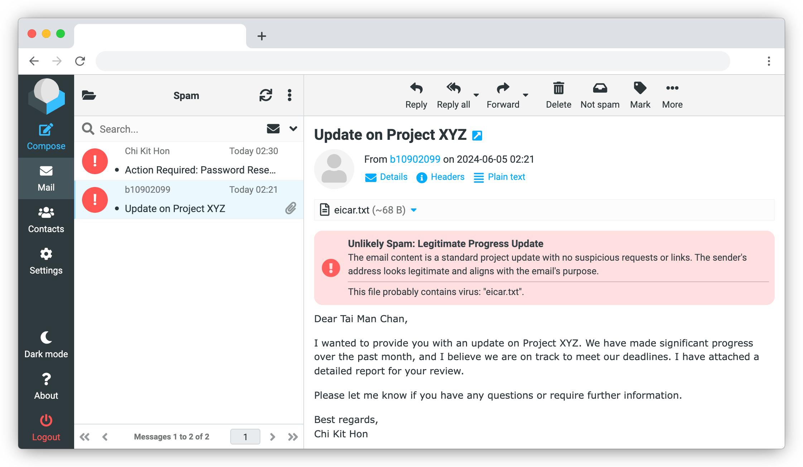

# RC+PLUS

Gravatar integration in Roundcube message list, and banner warnings for spam, inflected or tampered messages.

## 📸 Screenshots

 
 

## 🚀 Features

### Avatars

-   Display the sender's Gravatar
-   If the sender doesn't have one, use the first letter in the name and the MD5 colour of the address.
-   For mails in the Junk box, display an exclamation mark on a red background.

### Scan result banner

-   Display a green bar if the message is unlikely a spam and the attachments contain no virus.active
-   Otherwise, display a red bar to notify users.
-   Scaning is done by the MTA, and the report is shown above the mail body.

### Warning message triggers

-   The mail is probably or potentially a spam
-   The mail attaches files that contain virus
-   The mail fail the [DKIM](https://www.cloudflare.com/en-gb/learning/dns/dns-records/dns-dkim-record/) check
-   The mail is manually moved to the Junk folder by the user

## 🛠 Setup

To install, get the plugin with composer in your Roundcube directory

```
composer require kinoras/rcplus
```

## 📝 License

Permissively licensed under the MIT license.  
Special thanks to [Varun Patil](https://github.com/pulsejet) for creating the foundation of this project.
